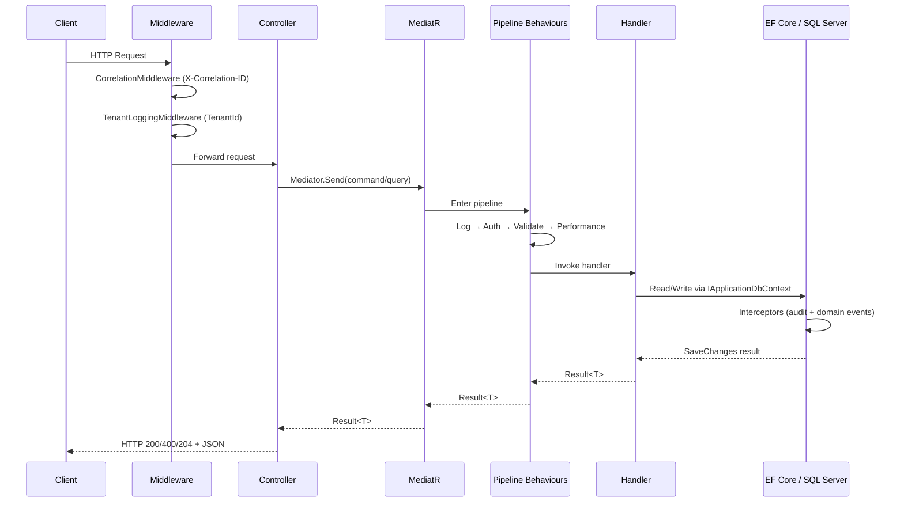

# 01 — Request Lifecycle

> **Sequence:** HTTP request enters the API → middleware → controller → MediatR → handler → database → response  
> **Previous:** [App Architecture Guide](../App-Architecture-Guide.md)  
> **Next:** [02 — MediatR Pipeline](02-mediatr-pipeline.md)

---

## Overview

Every API call in NWC follows the same path. Understanding this sequence helps you debug issues (404 vs 400 vs 500) and know where to add code.

---

## Step-by-Step Sequence



---

## 1. Application Startup (`Program.cs`)

Before any request arrives, the host wires all services:

```csharp
// src/WebApps/NWC.API/Program.cs (simplified)
builder.AddSerilogLogging();
builder.AddAuditLoggingServices();
builder.AddApplicationServices();      // MediatR, FluentValidation, AutoMapper
builder.AddInfrastructureServices();   // EF Core, Identity
builder.AddWebServices();              // IUser / CurrentUser
builder.Services.AddSwaggerDocs();

app.UseTenantLogging();
app.UseAuditLogging();                 // CorrelationMiddleware inside
app.UseAuthorization();
app.MapControllers();
```

**Key rule:** Do not add business logic here. Use `DependencyInjection.cs` extension methods in each project.

---

## 2. Middleware Layer

### CorrelationMiddleware

**File:** `src/Shared/Shared.Logs/Middleware/CorrelationMiddleware.cs`

| Step | Action |
|------|--------|
| 1 | Read `X-Correlation-ID` header from the client |
| 2 | If missing, generate a new GUID |
| 3 | Store in `HttpContext.Items["CorrelationId"]` |
| 4 | Echo back in response header |

The correlation ID flows into `Result<T>` responses so clients can reference a specific failed request in support tickets.

### TenantLoggingMiddleware

**File:** `src/Shared/Shared.Logs/Middleware/TenantLoggingMiddleware.cs`

| Priority | Source |
|----------|--------|
| 1 | HTTP header `X-Tenant-Id` |
| 2 | Query string `tenantId` |
| 3 | JWT claim `tenant_id`, `TenantId`, or `tenant` |
| 4 | Default: `"NWC"` |

Pushes `TenantId` into Serilog `LogContext` so every log line for that request includes the tenant.

---

## 3. Controller Layer (Thin)

Controllers inherit from `ApiControllerBase` and only dispatch MediatR requests.

```csharp
// src/WebApps/NWC.API/Controllers/TodoListsController.cs
[Authorize]
public class TodoListsController : ApiControllerBase
{
    [HttpPost]
    public async Task<ActionResult<Result<int>>> Create(CreateTodoListCommand command)
    {
        var result = await Mediator.Send(command);
        if (!result.IsSuccess)
            return BadRequest(result);
        return Ok(result);
    }
}
```

**Controller responsibilities:**
- Route mapping (`[HttpGet]`, `[HttpPost]`, etc.)
- Call `Mediator.Send(...)`
- Map `Result<T>` to HTTP status codes
- **Nothing else** — no validation, no DbContext, no business rules

See [10-api-layer.md](10-api-layer.md) for controller conventions.

---

## 4. MediatR Dispatch

When `Mediator.Send(command)` is called:

1. MediatR resolves the matching `IRequestHandler<TRequest, TResponse>`
2. Runs all registered `IPipelineBehavior<,>` instances (see [02-mediatr-pipeline.md](02-mediatr-pipeline.md))
3. Invokes the handler
4. Returns the handler's `Result<T>`

Registration is in `src/modules/Application/DependencyInjection.cs`.

---

## 5. Handler Execution

Handlers live in the Application layer and inject abstractions:

```csharp
public class CreateTodoListCommandHandler : IRequestHandler<CreateTodoListCommand, Result<int>>
{
    private readonly IApplicationDbContext _context;

    public async Task<Result<int>> Handle(CreateTodoListCommand request, CancellationToken cancellationToken)
    {
        var entity = new TodoList { Title = request.Title };
        _context.TodoLists.Add(entity);
        await _context.SaveChangesAsync(cancellationToken);
        return Result<int>.Success(entity.Id);
    }
}
```

**Handler responsibilities:**
- Orchestrate the use case
- Create/load domain entities
- Call `_context.SaveChangesAsync()`
- Return `Result<T>.Success(...)` or `Result<T>.Fail(...)`

---

## 6. SaveChanges & Interceptors

When `SaveChangesAsync()` runs, two EF Core interceptors fire **before** the SQL is sent:

| Interceptor | Purpose |
|-------------|---------|
| `AuditableEntityInterceptor` | Sets `Created`, `LastModified`, `CreatedBy`, etc. on auditable entities |
| `DispatchDomainEventsInterceptor` | Collects domain events from entities and publishes them via MediatR |

Domain event handlers (e.g. `TodoItemCreatedEventHandler`) run **after** events are collected but **before** the transaction commits.

---

## 7. Response Mapping

| Handler Result | Typical Controller Response |
|----------------|----------------------------|
| `Result<T>.Success(data)` | `200 OK` with JSON body |
| `Result<T>.Fail(...)` | `400 BadRequest` with error details |
| Validation failure (exception) | Caught by global filter → `400` with validation errors |
| Unauthorized (exception) | `401` / `403` |

The `Result<T>` shape:

```json
{
  "isSuccess": true,
  "data": 42,
  "errors": [],
  "correlationId": "abc-123-def"
}
```

---

## Debugging Checklist

When a request fails, trace backwards:

1. **Check Swagger / HTTP status** — 400 = validation or business failure; 401/403 = auth; 500 = unhandled exception
2. **Check correlation ID** — search logs by `X-Correlation-ID`
3. **Check feature log folder** — e.g. `logs/CreateTodoList/Error/`
4. **Check MediatR pipeline** — was validation or authorization the blocker?
5. **Check EF migration** — did the schema change without a migration?

---

## File Reference Map

| Step | Primary Files |
|------|---------------|
| Startup | `src/WebApps/NWC.API/Program.cs` |
| Middleware | `src/Shared/Shared.Logs/Middleware/*.cs` |
| Controller | `src/WebApps/NWC.API/Controllers/*.cs` |
| MediatR DI | `src/modules/Application/DependencyInjection.cs` |
| Handler | `src/modules/Application/{Feature}/Commands\|Queries/**/*.cs` |
| DbContext | `src/modules/Infrastructure/Data/ApplicationDbContext.cs` |
| Interceptors | `src/modules/Infrastructure/Data/Interceptors/*.cs` |
