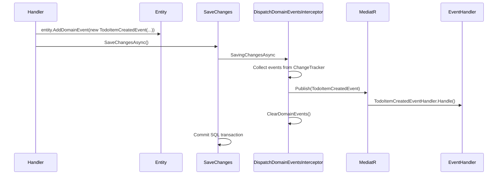

# 04 — Domain Layer

> **Sequence:** Business concept → entity → invariants → domain events → value objects  
> **Previous:** [03 — Vertical Slice Structure](03-vertical-slice-structure.md)  
> **Next:** [05 — Infrastructure & Data](05-infrastructure-data.md)

---

## Purpose

The Domain layer (`src/modules/Domain/`) is the **business core**. It contains:

- **Entities** — things with identity (TodoItem, TodoList)
- **Value Objects** — immutable objects defined by their values (Colour)
- **Domain Events** — things that happened (TodoItemCreatedEvent)
- **Enums** — business classifications (PriorityLevel)
- **Constants** — roles, policies

The Domain project references only `Shared.Core` (for base classes). It has **no** dependency on Application, Infrastructure, or API.

---

## Light DDD — What We Do and Don't Do

| We DO | We DON'T (yet) |
|-------|----------------|
| Put behavior on entities (`TodoItem.Done` raises event) | Strict aggregate boundaries with repository-per-aggregate |
| Use factory methods for complex creation | Full ubiquitous language workshops |
| Raise domain events | Separate bounded context deployables |
| Use value objects (Colour) | Event sourcing |
| Throw domain exceptions | Anemic models with all logic in services |

The codebase is evolving toward richer domain models. New entities should follow the **factory + private constructor** pattern described in `CLAUDE.md`.

---

## Entity Hierarchy

```
Shared.Core.Entities.BaseEntity<T>
    └── Id, DomainEvents collection
Shared.Core.Entities.BaseAuditableEntity
    └── Created, CreatedBy, LastModified, LastModifiedBy, IsActive
KH.Domain.Entities.TodoItem
KH.Domain.Entities.TodoList
```

### BaseEntity — Domain Events

```csharp
// Shared.Core/Entities/BaseEntity.cs
public abstract class BaseEntity
{
    private readonly List<BaseEvent> _domainEvents = new();
    public IReadOnlyCollection<BaseEvent> DomainEvents => _domainEvents.AsReadOnly();

    public void AddDomainEvent(BaseEvent domainEvent) => _domainEvents.Add(domainEvent);
    public void ClearDomainEvents() => _domainEvents.Clear();
}
```

Handlers or entity methods call `AddDomainEvent(...)`. Events are dispatched by `DispatchDomainEventsInterceptor` on `SaveChanges`.

---

## Entity Example: TodoItem

```csharp
// src/modules/Domain/Entities/TodoItem.cs
public class TodoItem : BaseAuditableEntity
{
    public int ListId { get; set; }
    public string? Title { get; set; }

    private bool _done;
    public bool Done
    {
        get => _done;
        set
        {
            if (value && !_done)
                AddDomainEvent(new TodoItemCompletedEvent(this));
            _done = value;
        }
    }

    public TodoList List { get; set; } = null!;
}
```

**Key pattern:** Setting `Done = true` automatically raises `TodoItemCompletedEvent`. Business logic lives on the entity, not in a separate service.

---

## Domain Events

Domain events represent something meaningful that happened in the domain.

```
src/modules/Domain/Events/
├── TodoItemCreatedEvent.cs
├── TodoItemCompletedEvent.cs
└── TodoItemDeletedEvent.cs
```

Example:

```csharp
public class TodoItemCreatedEvent : BaseEvent
{
    public TodoItemCreatedEvent(TodoItem item)
    {
        Item = item;
    }
    public TodoItem Item { get; }
}
```

### Event Flow



Event handlers live in **Application** (not Domain):

```
Application/TodoItems/EventHandlers/TodoItemCreatedEventHandler.cs
```

They implement `INotificationHandler<TodoItemCreatedEvent>` and can send emails, update caches, or log — side effects only.

---

## Value Objects

```csharp
// src/modules/Domain/ValueObjects/Colour.cs
public class Colour : ValueObject  // from Shared.Core
{
    public static Colour From(string code) { ... }
    public static Colour White => new("#FFFFFF");
    // ...
}
```

Value objects:
- Have no identity (two Colours with same code are equal)
- Are immutable
- Validate themselves on creation

---

## Constants & Policies

```
src/modules/Domain/Constants/
├── Roles.cs          ← "Administrator", etc.
└── Policies.cs       ← "CanPurge", etc.
```

Used by `AuthorizationBehaviour` and Infrastructure DI:

```csharp
options.AddPolicy(Policies.CanPurge, policy => policy.RequireRole(Roles.Administrator));
```

---

## Target Entity Pattern (For New Features)

When creating new entities, prefer this pattern:

```csharp
public sealed class Order : BaseAuditableEntity
{
    private Order() { }  // EF Core only

    public string CustomerName { get; private set; } = default!;

    public static Order Create(string customerName)
    {
        if (string.IsNullOrWhiteSpace(customerName))
            throw new DomainException("Customer name is required.");
        return new Order { CustomerName = customerName.Trim() };
    }

    public void Ship()
    {
        AddDomainEvent(new OrderShippedEvent(this));
    }
}
```

| Element | Purpose |
|---------|---------|
| Private parameterless ctor | EF Core materialization only |
| Private setters | Prevent invalid state changes outside methods |
| Static `Create` factory | Enforces invariants at creation |
| Methods for behavior | `Ship()`, `Cancel()` — not public setters |

---

## Domain Layer Checklist for New Features

- [ ] Entity in `Domain/Entities/`
- [ ] Enums in `Domain/Enums/` if needed
- [ ] Value objects in `Domain/ValueObjects/` if needed
- [ ] Domain events in `Domain/Events/` for significant state changes
- [ ] No references to Application or Infrastructure
- [ ] Business rules on entity, not in handler (when practical)

---

## File Reference

| Type | Location |
|------|----------|
| Entities | `src/modules/Domain/Entities/` |
| Events | `src/modules/Domain/Events/` |
| Value Objects | `src/modules/Domain/ValueObjects/` |
| Enums | `src/modules/Domain/Enums/` |
| Constants | `src/modules/Domain/Constants/` |
| Base classes | `src/Shared/Shared.Core/Entities/` |
