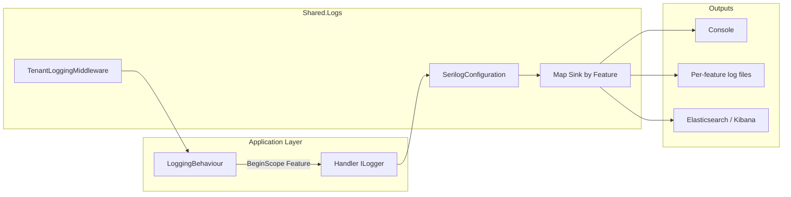

# 06 — Logging & Audit

> **Sequence:** Request → tenant/correlation enrichment → MediatR logging scope → Serilog sinks → files/Elasticsearch  
> **Previous:** [05 — Infrastructure & Data](05-infrastructure-data.md)  
> **Next:** [07 — Authentication & Authorization](07-authentication-authorization.md)

---

## Two Logging Systems

NWC has **two complementary** logging mechanisms:

| System | Purpose | Storage |
|--------|---------|---------|
| **Serilog (Shared.Logs)** | Application diagnostics, feature-scoped files, Elasticsearch | File system + Elasticsearch |
| **Audit logging (Hangfire)** | Request/response audit trail for compliance | SQL Server (`AuditEntry` table) |

---

## Serilog Architecture



**Key design decision:** Application code never references Serilog directly. It uses `ILogger<T>` and `BeginScope`. Shared.Logs translates scopes into Serilog `LogContext` properties.

---

## Log File Layout

```
logs/
├── CreateTodoItem/              ← auto-created from command name
│   ├── Trace/                   createTodoItem-trace-2026-06-20.log
│   ├── Information/             createTodoItem-info-2026-06-20.log
│   └── Error/                   createTodoItem-error-2026-06-20.log
├── GetTodos/
│   └── Information/
└── _global/                     ← logs without Feature scope
    ├── Information/
    └── Error/
```

Configured in `src/Shared/Shared.Logs/Configuration/SerilogConfiguration.cs` using `WriteTo.Map` keyed on the `Feature` property.

---

## How Feature Routing Works

1. **LoggingBehaviour** strips `Command`/`Query` from request name → `CreateTodoItem`
2. Pushes scope: `BeginScope({ "Feature": "CreateTodoItem" })`
3. All `ILogger` calls inside the handler inherit this scope
4. Serilog Map sink routes to `logs/CreateTodoItem/...`

**You do not need to update Serilog config when adding features.** Name your commands/queries correctly and folders appear automatically.

---

## Tenant Enrichment

**File:** `src/Shared/Shared.Logs/Middleware/TenantLoggingMiddleware.cs`

Registered early in pipeline (`Program.cs` → `app.UseTenantLogging()`).

Resolution order:
1. Header `X-Tenant-Id`
2. Query `?tenantId=`
3. JWT claims: `tenant_id`, `TenantId`, `tenant`
4. Default: `"NWC"`

Console template includes tenant:

```
[14:32:01 INF] [NWC] CreateTodoItem       KH Request: CreateTodoItemCommand ...
```

---

## Correlation ID

**File:** `src/Shared/Shared.Logs/Middleware/CorrelationMiddleware.cs`

| Header | Direction |
|--------|-----------|
| `X-Correlation-ID` | Request in → stored in `HttpContext.Items` → response out |

Used in `Result<T>.CorrelationId` so API clients can trace failures.

Registered via `app.UseAuditLogging()` which calls `UseMiddleware<CorrelationMiddleware>()`.

---

## Elasticsearch / Kibana

When `ElasticConfiguration:Uri` is set (e.g. `http://localhost:9200` in Development):

- Logs ship to index pattern: `nwc-logs-{environment}-{yyyy-MM}`
- Example: `nwc-logs-development-2026-06`
- View in Kibana with data view `nwc-logs-*`

Setup guide: [Elasticsearch-Kibana-Setup.md](../Elasticsearch-Kibana-Setup.md)

---

## Log Levels by Sink

| Level | Per-feature folder | Global folder |
|-------|-------------------|---------------|
| Verbose, Debug | `Trace/` | — |
| Information, Warning | `Information/` | `_global/Information/` |
| Error, Fatal | `Error/` | `_global/Error/` |

Minimum levels overridden in `appsettings.Development.json`:

```json
{
  "Serilog": {
    "MinimumLevel": {
      "Default": "Information",
      "Override": {
        "Microsoft": "Warning",
        "Microsoft.EntityFrameworkCore": "Warning"
      }
    }
  }
}
```

---

## Audit Logging (Hangfire)

Separate from Serilog diagnostics — persists structured audit records.

### Components

| Component | Role |
|-----------|------|
| `AddAuditLoggingServices()` | Registers Hangfire, `ICallerResolver`, audit options |
| `AuditService` | Saves `AuditEntry` to DB on `"audit"` queue |
| `AuditLogAttribute` | Marks controller actions for request/response capture |
| Hangfire Dashboard | `/hangfire` — monitor background jobs (dev/admin) |

### Flow

```
HTTP Request
  → CorrelationMiddleware
  → Controller action (optionally [AuditLog])
  → Capture request/response metadata
  → Enqueue Hangfire job on "audit" queue
  → AuditService.SaveAsync(AuditEntry)
  → SQL Server AuditLogs table
```

Hangfire can be disabled via `HangfireJobsOptions.Enabled` in configuration — audit falls back to direct async persistence.

---

## Writing Logs in Your Code

### In Handlers (Preferred)

Rely on `LoggingBehaviour` for request-level logging. Add handler-specific logs with injected `ILogger`:

```csharp
public class MyHandler : IRequestHandler<MyCommand, Result<int>>
{
    private readonly ILogger<MyHandler> _logger;

    public async Task<Result<int>> Handle(MyCommand request, CancellationToken ct)
    {
        _logger.LogInformation("Processing order {OrderId}", request.OrderId);
        // Feature scope is already set by LoggingBehaviour
        ...
    }
}
```

### In Event Handlers

```csharp
_logger.LogInformation("KH Domain Event: {DomainEvent}", notification.GetType().Name);
```

### Do NOT

- Reference Serilog types in Application layer
- Hardcode log file paths
- Log sensitive data (passwords, tokens, full credit card numbers)

---

## Configuration Files

| Setting | Location |
|---------|----------|
| Serilog levels | `appsettings.json`, `appsettings.Development.json` |
| Log base path | `Logging:BasePath` (default: `logs`) |
| Elasticsearch URI | `ElasticConfiguration:Uri` |
| Hangfire options | `HangfireJobs` section |
| Connection strings | `ConnectionStrings:KHDb`, `AuditDbConnection` |

---

## Troubleshooting

| Problem | Solution |
|---------|----------|
| Logs only in `_global` | Check command name ends with `Command` or `Query`; verify LoggingBehaviour runs |
| No Elasticsearch indices | Ensure ES is running; hit any API endpoint; check `ElasticConfiguration:Uri` |
| Missing TenantId in logs | Send `X-Tenant-Id` header or configure JWT claim |
| Audit not persisting | Check Hangfire dashboard; verify `HangfireJobs:Enabled` is true |
| EF SQL noise in logs | Already suppressed — `Microsoft.EntityFrameworkCore` → Warning |

---

## Related Docs

- [How-Logs-Works.md](../How-Logs-Works.md) — detailed Serilog configuration snippets
- [Elasticsearch-Kibana-Setup.md](../Elasticsearch-Kibana-Setup.md) — Kibana first-time setup
