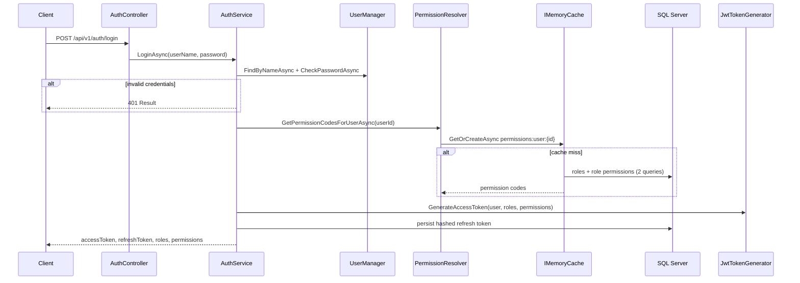
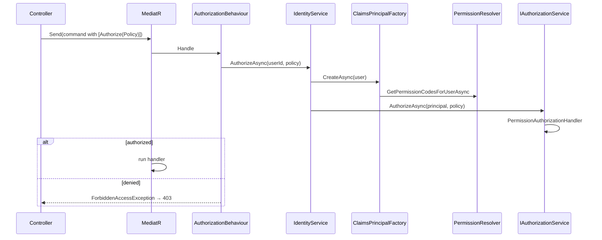
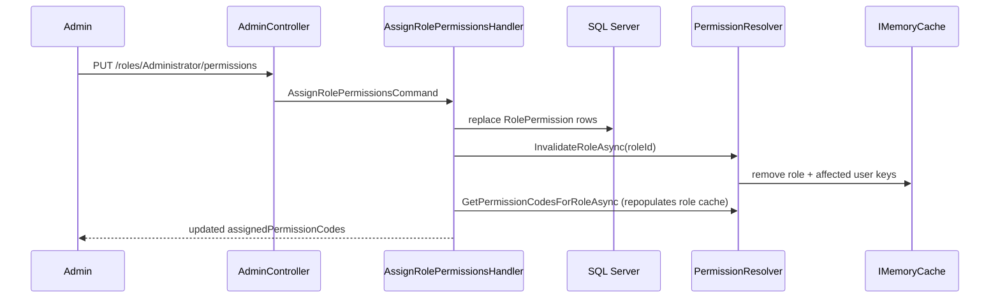

# Auth & Permissions — Flow, Caching, and .NET Authorization

> **Audience:** Developers working on admin/back-office APIs or extending permission policies  
> **Related:** [Postman collection](../postman/NWC-Auth-Postman-Curl.md) · [App flow — Auth overview](../app-flow/07-authentication-authorization.md)

---

## Summary

NWC uses **two separate authentication models**:

| Model | Used by | Credential | Authorization |
|-------|---------|------------|---------------|
| **JWT Bearer** | `/api/v1/auth/*`, `/api/v1/admin/*` | `Authorization: Bearer <token>` | DB-driven **permission policies** (cached) |
| **API key** | Sessions, lookup, webhooks, most reports | `X-Api-Key` header | Consumer config in `ExternalConsumers` (not permission table) |

Permissions are **not hard-coded per role in code**. They are stored in `SM_PERMISSION` and `SM_ROLE_PERMISSION`, resolved at runtime, and cached in memory for 15 minutes.

---

## Data model

```
AspNetUsers ──┬── AspNetUserRoles ── AspNetRoles
              │
              └── SM_USER_REFRESH_TOKEN

AspNetRoles ── SM_ROLE_PERMISSION ── SM_PERMISSION
```

| Table / entity | Purpose |
|----------------|---------|
| `Permission` (`SM_PERMISSION`) | Catalog of permission codes (`CanManageSessions`, …) with module and display names |
| `RolePermission` (`SM_ROLE_PERMISSION`) | Many-to-many: which permissions each Identity role has |
| `UserRefreshToken` (`SM_USER_REFRESH_TOKEN`) | Hashed refresh tokens for login rotation |
| ASP.NET Identity roles | Standard `AspNetRoles` / `AspNetUserRoles` — users get permissions **through roles** |

Permission **codes** double as **policy names** (see `Policies` in `Domain/Constants/Policies.cs`).

---

## Login and token issuance



### What goes into the JWT

`JwtTokenGenerator` embeds:

| Claim type | Example | Purpose |
|------------|---------|---------|
| `sub` / `NameIdentifier` | user GUID | User identity |
| `role` | `Administrator` | ASP.NET role checks |
| `permission` | `CanManageSessions` | Fast policy checks without DB |

The login/refresh response body also returns `roles` and `permissions` for the client UI.

### Refresh flow

`POST /api/v1/auth/refresh` validates the hashed refresh token in the database, **revokes** the old refresh token, then runs the same `IssueTokensAsync` path as login (fresh permissions from cache/DB, new JWT, new refresh token).

---

## How .NET authorizes an HTTP request

ASP.NET Core runs authentication and authorization **middleware** before your controller action:

```
HTTP Request
    │
    ▼
UseAuthentication()          ← JWT Bearer validates token → HttpContext.User
    │
    ▼
UseAuthorization()           ← evaluates [Authorize] on controller/action
    │
    ▼
Controller action            ← may call Mediator.Send(...)
    │
    ▼
MediatR AuthorizationBehaviour  ← second check on command/query [Authorize]
    │
    ▼
Handler
```

Registration in `Program.cs`:

```csharp
app.UseAuthentication();
app.UseAuthorization();
```

Infrastructure registers JWT, policies, and the custom permission handler in `Infrastructure/DependencyInjection.cs`.

---

## Policy resolution (`PermissionPolicyProvider`)

When code references `[Authorize(Policy = "CanManageSessions")]`, ASP.NET asks `IAuthorizationPolicyProvider` for a policy.

Our `PermissionPolicyProvider` builds policies dynamically:

| Policy name pattern | Requirement type | Meaning |
|---------------------|------------------|---------|
| Known code in `Policies.All` | `PermissionRequirement` | User must have that permission |
| `Permissions.Any:Code1,Code2` | `AnyPermissionRequirement` | User must have **at least one** listed permission |
| Anything else | Default provider | Standard ASP.NET policies (if registered) |

Example OR policy constant:

```csharp
// PermissionPolicies.CanViewCallReportsOrManageSessions
"Permissions.Any:CanViewCallReports,CanManageSessions"
```

---

## Permission evaluation (`PermissionAuthorizationHandler`)

After authentication, `PermissionAuthorizationHandler` evaluates permission requirements:

```mermaid
flowchart TD
    A[HandleAsync called] --> B{Pending requirements include<br/>PermissionRequirement or<br/>AnyPermissionRequirement?}
    B -->|No| Z[Return immediately — no DB/cache work]
    B -->|Yes| C{JWT has any<br/>permission claim?}
    C -->|Yes| D[resolvedSet = null<br/>check JWT claims only]
    C -->|No| E[PermissionResolver.GetPermissionCodesForUserAsync]
    E --> F[IMemoryCache hit or DB load]
    F --> G[Build HashSet for O(1) lookup]
    D --> H[For each requirement: Succeed or skip]
    G --> H
```

### Check order for a single permission

1. **JWT claim** — `user.HasClaim("permission", code)` → allow  
2. **Resolved list** (only when JWT has no permission claims) — cached DB permissions → allow  
3. Otherwise → requirement not satisfied → **403 Forbidden** at HTTP layer

### Important behaviors

- **Early exit:** If the current authorization evaluation has no permission requirements (e.g. only `RequireAuthenticatedUser`), the handler does **nothing** — no cache or database access.
- **JWT-first:** When the access token already contains `permission` claims, the handler does **not** call `PermissionResolver` for that request. This keeps protected endpoints fast.
- **JWT staleness:** If an admin changes role permissions, **existing access tokens keep old claims** until they expire. Users must **login or refresh** to pick up new permissions in the JWT. MediatR policy checks (see below) can still see updated DB permissions sooner.

---

## Two authorization layers (defense in depth)

### 1. Controller / action — ASP.NET `[Authorize]`

```csharp
[Authorize]
[Route("api/v1/admin")]
public sealed class AdminController : ApiControllerBase
{
    [Authorize(Policy = Policies.CanManageSessions)]
    public async Task<IActionResult> GetSystemStatus(...) { ... }
}
```

- Uses `HttpContext.User` from the **JWT** middleware.
- Permission policies → `PermissionAuthorizationHandler` (JWT claims first).

### 2. MediatR — `AuthorizationBehaviour`

Commands/queries can declare:

```csharp
[Authorize(Policy = Policies.CanManageRolePermissions)]
public record AssignRolePermissionsCommand : IRequest<Result<RolePermissionsDto>>;
```

Pipeline order (see `Application/DependencyInjection.cs`):

1. `UnhandledExceptionBehaviour`
2. **`AuthorizationBehaviour`** ← checks `_user.Id` and calls `IIdentityService`
3. `ValidationBehaviour`
4. `PerformanceBehaviour`
5. `LoggingBehaviour`

`IIdentityService.AuthorizeAsync` does **not** reuse the JWT principal directly. It:

1. Loads the user from Identity  
2. Builds a fresh `ClaimsPrincipal` via `ApplicationUserClaimsPrincipalFactory`  
3. Calls `IAuthorizationService.AuthorizeAsync(principal, policyName)`

`ApplicationUserClaimsPrincipalFactory` adds permission claims from `PermissionResolver` (cached DB path). So **MediatR policy checks always reflect current DB permissions** (within cache TTL), even if the JWT is slightly stale.



| Layer | Principal source | Permission source |
|-------|------------------|-------------------|
| HTTP `[Authorize(Policy)]` | JWT `HttpContext.User` | JWT `permission` claims, else cache/DB |
| MediatR `[Authorize(Policy)]` | Rebuilt from Identity user | Cache/DB via `PermissionResolver` |

---

## Caching (`PermissionResolver`)

**Implementation:** `Infrastructure/Services/PermissionResolver.cs`  
**Backing store:** `IMemoryCache` (in-process, per application instance)

### Cache keys and TTL

| Key pattern | Content | TTL |
|-------------|---------|-----|
| `permissions:user:{userId}` | Distinct active permission codes for user (all roles) | **15 minutes** |
| `permissions:role:{roleId}` | Permission codes assigned to one role | **15 minutes** |

Missing user entries use a **1 minute** TTL to avoid hammering Identity for invalid IDs.

### Database queries on cache miss (per user)

One resolution path uses **two EF queries** (not N+1 per role):

1. Resolve role IDs from role names  
2. Load distinct permission codes from `RolePermissions` where `Permission.IsActive`

All queries use `AsNoTracking()`.

### Population API

`GetOrCreateAsync` ensures concurrent requests for the same key share one factory execution under normal `IMemoryCache` behavior.

### Invalidation

| Trigger | Method | Effect |
|---------|--------|--------|
| Role permissions updated (`AssignRolePermissions`) | `InvalidateRoleAsync(roleId)` | Removes role cache + **every user cache** in that role |
| Manual (if needed later) | `InvalidateUser(userId)` | Removes one user's cache |

After invalidation, the next login, refresh, MediatR authorize call, or cache miss reloads from the database.

**No synchronous blocking** on the request path — invalidation and resolution are fully async.

---

## Admin permission management flow



To see the change in **JWT claims**, the user must **login or refresh** after cache invalidation.

---

## HTTP status codes

| Situation | HTTP | Mechanism |
|-----------|------|-----------|
| No or invalid JWT on `[Authorize]` endpoint | **401** | JWT middleware or auth filter |
| Valid JWT, missing permission | **403** | Authorization middleware / handler |
| MediatR: not authenticated | **401** | `UnauthorizedAccessException` |
| MediatR: authenticated, policy/role failed | **403** | `ForbiddenAccessException` |
| Login bad password | **401** | `Result` from `AuthService` |

---

## Permission catalog (seeded)

| Code | Module | Typical use |
|------|--------|-------------|
| `CanPurge` | Admin | Destructive purge operations |
| `CanViewCallReports` | Reports | Call cost report exports |
| `CanManageSessions` | Sessions | Session admin / system status demo |
| `CanManageRolePermissions` | Admin | List and assign role permissions |

Seeding: `PermissionSeedData` in `ApplicationDbContextInitialiser` — Administrator role receives all permissions on first seed.

---

## API key auth (separate from permissions)

External integrations use `RequireApiKey` or `RequireApiKeyOrAdministrator` **authorization filters** — these run as MVC filters, not through `PermissionAuthorizationHandler`.

- **Sessions / lookup / webhooks:** `X-Api-Key` only  
- **Some reports:** `X-Api-Key` **or** JWT with `Administrator` **role** (not permission table)

API keys are configured per consumer in `ExternalConsumers` appsettings; they do not use `SM_PERMISSION`.

---

## Key source files

| Area | Path |
|------|------|
| Login / refresh | `Application/Auth/`, `Infrastructure/Identity/AuthService.cs` |
| JWT creation | `Infrastructure/Identity/JwtTokenGenerator.cs` |
| Permission cache | `Infrastructure/Services/PermissionResolver.cs` |
| Policy provider | `Infrastructure/Authorization/PermissionPolicyProvider.cs` |
| Policy handler | `Infrastructure/Authorization/PermissionAuthorizationHandler.cs` |
| MediatR auth | `Application/Common/Behaviours/AuthorizationBehaviour.cs` |
| Identity bridge | `Infrastructure/Identity/IdentityService.cs` |
| Claims factory | `Infrastructure/Identity/ApplicationUserClaimsPrincipalFactory.cs` |
| Admin API | `WebApps/NWC.API/Controllers/AdminController.cs` |
| Constants | `Domain/Constants/Policies.cs`, `PermissionPolicies.cs`, `PermissionClaimTypes.cs` |
| DI wiring | `Infrastructure/DependencyInjection.cs` |

---

## Operational notes

1. **Run migrations** for `SM_PERMISSION`, `SM_ROLE_PERMISSION`, and `SM_USER_REFRESH_TOKEN` before using auth in a new environment.
2. **Cache is per instance** — in multi-node deployments, consider `IDistributedCache` (Redis) if permission changes must propagate instantly across nodes (not required for single-instance or tolerant 15-minute window).
3. **Protect `JwtSettings:SigningKey`** — user secrets or environment variables; minimum 32 characters.
4. **Adding a new permission:** add constant to `Policies.All`, seed row in `PermissionSeedData`, assign to roles via admin API or seed, use `[Authorize(Policy = Policies.YourNewCode)]` on controllers and/or MediatR requests.

---

## Quick mental model

```
Login  →  DB permissions (cached)  →  JWT with permission claims
                │
Request  →  Authenticate JWT  →  Authorize policy
                │                      │
                │                      ├─ HTTP: prefer JWT claims (fast)
                │                      └─ MediatR: rebuild principal from DB cache
                │
Assign role permissions  →  invalidate cache  →  re-login for new JWT claims
```
