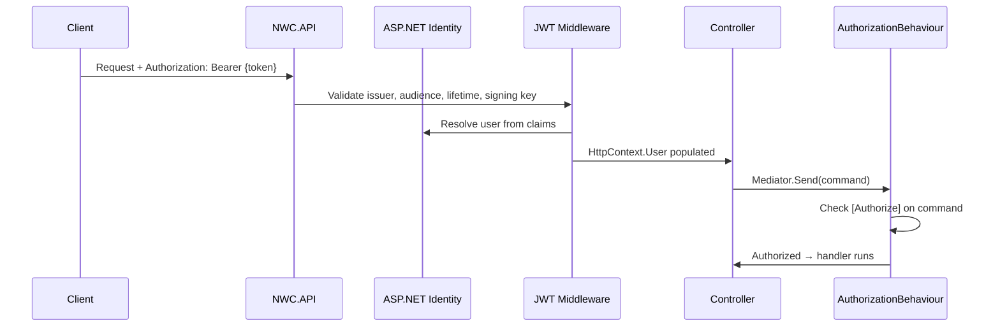

# 07 — Authentication & Authorization

> **Sequence:** JWT token → Identity → IUser → AuthorizationBehaviour → handler  
> **Deep dive (auth + DB permissions + caching):** [Auth & Permissions Flow](../auth/Auth-and-Permissions-Flow.md)  
> **Previous:** [06 — Logging & Audit](06-logging-and-audit.md)  
> **Next:** [08 — Shared Libraries](08-shared-libraries.md)

---

## Overview

NWC uses **JWT Bearer authentication** with **ASP.NET Identity** for user storage and **policy/role-based authorization** at two levels:

1. **Controller level** — `[Authorize]` on controllers/actions
2. **MediatR level** — `[Authorize]` on command/query records (enforced by `AuthorizationBehaviour`)

Defense in depth: even if a controller forgets `[Authorize]`, the MediatR pipeline can still block unauthorized requests.

---

## Authentication Flow



### JWT Configuration

Settings under `JwtSettings` in appsettings (use user secrets in development):

| Setting | Purpose |
|---------|---------|
| Issuer | Token issuer validation |
| Audience | Token audience validation |
| SigningKey | Symmetric key for signature |
| Expiry | Token lifetime |

**Never commit signing keys to source control.**

---

## IUser Abstraction

Handlers and behaviours do not access `HttpContext` directly. They use `IUser`:

**Interface:** `src/modules/Application/Common/Interfaces/IUser.cs`  
**Implementation:** `src/WebApps/NWC.API/Services/CurrentUser.cs`

```csharp
public interface IUser
{
    string? Id { get; }
}
```

Registered in `NWC.API/DependencyInjection.cs`:

```csharp
builder.Services.AddScoped<IUser, CurrentUser>();
```

`CurrentUser` reads the authenticated user's ID from `HttpContext.User` claims.

---

## IIdentityService

**Interface:** `Application/Common/Interfaces/IIdentityService.cs`  
**Implementation:** `Infrastructure/Identity/IdentityService.cs`

Used by authorization and logging behaviours:

| Method | Purpose |
|--------|---------|
| `GetUserNameAsync(userId)` | Resolve username for logs |
| `IsInRoleAsync(userId, role)` | Role-based authorization |
| `AuthorizeAsync(userId, policy)` | Policy-based authorization |

---

## MediatR Authorization

**File:** `Application/Common/Behaviours/AuthorizationBehaviour.cs`

Checks custom `[Authorize]` attribute on the **request type**:

```csharp
// Application/Common/Security/AuthorizeAttribute.cs
[AttributeUsage(AttributeTargets.Class, AllowMultiple = true)]
public class AuthorizeAttribute : Attribute
{
    public string? Roles { get; set; }
    public string? Policy { get; set; }
}
```

### Usage on Commands

```csharp
[Authorize(Roles = Roles.Administrator)]
public record DeleteTodoListCommand(int Id) : IRequest<Result<Unit>>;
```

### Usage with Policies

```csharp
[Authorize(Policy = Policies.CanPurge)]
public record PurgeTodoItemsCommand : IRequest<Result<Unit>>;
```

Policies registered dynamically via `PermissionPolicyProvider` and `PermissionAuthorizationHandler` (see [Auth & Permissions Flow](../auth/Auth-and-Permissions-Flow.md)).

---

## Authorization Decision Tree

```
Request has [Authorize] attribute?
├── No  → proceed to handler
└── Yes → User authenticated? (_user.Id != null)
          ├── No  → throw UnauthorizedAccessException (401)
          └── Yes → Roles specified?
                    ├── Yes → user in any listed role?
                    │         ├── No  → throw ForbiddenAccessException (403)
                    │         └── Yes → continue
                    └── Policy specified?
                              ├── Yes → IIdentityService.AuthorizeAsync?
                              │         ├── No  → ForbiddenAccessException (403)
                              │         └── Yes → continue
                              └── Continue to ValidationBehaviour
```

---

## Controller-Level Authorization

```csharp
[Authorize]  // All actions require authentication
public class TodoListsController : ApiControllerBase
{
    [HttpGet]
    public async Task<ActionResult<Result<TodosVm>>> Get() { ... }

    [AllowAnonymous]  // Override for public endpoints
    public async Task<IActionResult> PublicEndpoint() { ... }
}
```

| Attribute | Effect |
|-----------|--------|
| `[Authorize]` on controller | All actions need auth unless `[AllowAnonymous]` |
| `[Authorize(Roles = "...")]` | Role required at HTTP layer |
| No attribute | Public endpoint (still check MediatR `[Authorize]`) |

---

## API Key Authentication

Swagger documents an API key scheme (`X-Api-Key` header) for external system integration (WFM, TMS, IVR, Zoom).

Configured in `Shared.Swagger/DependencyInjection.cs`. Test controllers exist:

- `ApiKeyTestController.cs`
- `AuditTestController.cs`

See Swagger UI for interactive testing in Development.

---

## Roles & Policies Reference

**File:** `src/modules/Domain/Constants/Roles.cs`

```csharp
public abstract class Roles
{
    public const string Administrator = nameof(Administrator);
}
```

**File:** `src/modules/Domain/Constants/Policies.cs`

```csharp
public abstract class Policies
{
    public const string CanPurge = nameof(CanPurge);
    public const string CanViewCallReports = nameof(CanViewCallReports);
    public const string CanManageSessions = nameof(CanManageSessions);
    public const string CanManageRolePermissions = nameof(CanManageRolePermissions);
}
```

Add new permission codes to `Policies.All`, seed them in `PermissionSeedData`, and reference them from `[Authorize(Policy = ...)]`. Full flow: [Auth & Permissions Flow](../auth/Auth-and-Permissions-Flow.md).

---

## Exception Handling

| Exception | HTTP Status | When |
|-----------|-------------|------|
| `UnauthorizedAccessException` | 401 | Not authenticated |
| `ForbiddenAccessException` | 403 | Authenticated but not authorized |

These are handled by the global exception filter and returned as `Result<T>` JSON.

---

## Checklist for Securing a New Feature

- [ ] Decide: public, authenticated, role-restricted, or policy-restricted?
- [ ] Add `[Authorize]` on controller (or action)
- [ ] Add `[Authorize(Roles/Policy = ...)]` on command/query if needed
- [ ] Register new permission in `Policies.All` and `PermissionSeedData` if using DB-driven policies
- [ ] Test with and without valid JWT in Swagger
- [ ] Verify 401/403 responses include `correlationId`

---

## Common Mistakes

| Mistake | Fix |
|---------|-----|
| Auth only on controller | Also add `[Authorize]` on sensitive commands |
| Hardcoded role strings | Use `Roles.Administrator` constants |
| Accessing HttpContext in handler | Inject `IUser` instead |
| JWT secret in appsettings committed to git | Use user secrets / env vars |
