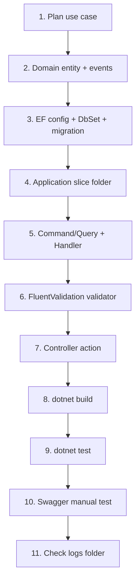

# 09 — Adding a New Feature (Step-by-Step)

> **Sequence:** Plan → Domain → Infrastructure → Application slice → API → Verify  
> **Previous:** [08 — Shared Libraries](08-shared-libraries.md)  
> **Next:** [10 — API Layer](10-api-layer.md)

---

## Before You Write Code

Answer these questions on paper (or in your ticket):

| Question | Example Answer |
|----------|----------------|
| What is the use case name? | "Create Product" |
| Command or query? | Command (writes data) |
| What entity is affected? | `Product` (new) |
| Input fields? | Name, Price, CategoryId |
| Output? | New product ID |
| Who can access it? | Authenticated users with role `Manager` |
| Needs migration? | Yes — new `Products` table |
| Domain events? | `ProductCreatedEvent` for notification |

---

## Full Workflow Diagram



---

## Step 1: Create the Domain Entity

**Path:** `src/modules/Domain/Entities/Product.cs`

```csharp
namespace KH.Domain.Entities;

public class Product : BaseAuditableEntity
{
    public string Name { get; set; } = default!;
    public decimal Price { get; set; }
    public int CategoryId { get; set; }
}
```

For richer models, use factory methods — see [04-domain-layer.md](04-domain-layer.md).

Optional domain event in `Domain/Events/ProductCreatedEvent.cs`.

---

## Step 2: Wire Up Infrastructure

### 2a. Add DbSet to interface

**File:** `Application/Common/Interfaces/IApplicationDbContext.cs`

```csharp
DbSet<Product> Products { get; }
```

### 2b. Add DbSet to context

**File:** `Infrastructure/Data/ApplicationDbContext.cs`

```csharp
public DbSet<Product> Products => Set<Product>();
```

### 2c. Create EF configuration

**File:** `Infrastructure/Data/Configurations/ProductConfiguration.cs`

```csharp
public class ProductConfiguration : IEntityTypeConfiguration<Product>
{
    public void Configure(EntityTypeBuilder<Product> builder)
    {
        builder.Property(p => p.Name).HasMaxLength(200).IsRequired();
        builder.Property(p => p.Price).HasPrecision(18, 2);
    }
}
```

### 2d. Create and apply migration

```bash
dotnet ef migrations add AddProductsTable \
  --project src/modules/Infrastructure \
  --startup-project src/WebApps/NWC.API

dotnet ef database update \
  --project src/modules/Infrastructure \
  --startup-project src/WebApps/NWC.API
```

Details: [05-infrastructure-data.md](05-infrastructure-data.md)

---

## Step 3: Create the Application Slice

### Folder structure

```
Application/Products/
├── Commands/
│   └── CreateProduct/
│       ├── CreateProduct.cs
│       └── CreateProductCommandValidator.cs
└── Queries/
    └── GetProducts/
        ├── GetProducts.cs
        └── ProductDto.cs
```

### 3a. Command + Handler

**File:** `Application/Products/Commands/CreateProduct/CreateProduct.cs`

```csharp
using KH.Application.Common.Interfaces;
using KH.Domain.Entities;
using KH.Domain.Events;

namespace KH.Application.Products.Commands.CreateProduct;

public record CreateProductCommand : IRequest<Result<int>>
{
    public string Name { get; init; } = default!;
    public decimal Price { get; init; }
    public int CategoryId { get; init; }
}

public class CreateProductCommandHandler : IRequestHandler<CreateProductCommand, Result<int>>
{
    private readonly IApplicationDbContext _context;

    public CreateProductCommandHandler(IApplicationDbContext context)
    {
        _context = context;
    }

    public async Task<Result<int>> Handle(CreateProductCommand request, CancellationToken cancellationToken)
    {
        var entity = new Product
        {
            Name = request.Name,
            Price = request.Price,
            CategoryId = request.CategoryId
        };

        entity.AddDomainEvent(new ProductCreatedEvent(entity));

        _context.Products.Add(entity);
        await _context.SaveChangesAsync(cancellationToken);

        return Result<int>.Success(entity.Id);
    }
}
```

### 3b. Validator (required for write commands)

**File:** `CreateProductCommandValidator.cs`

```csharp
public class CreateProductCommandValidator : AbstractValidator<CreateProductCommand>
{
    public CreateProductCommandValidator()
    {
        RuleFor(v => v.Name)
            .NotEmpty()
            .MaximumLength(200)
            .WithMessage("Product name is required and must not exceed 200 characters.");

        RuleFor(v => v.Price)
            .GreaterThan(0)
            .WithMessage("Price must be greater than zero.");

        RuleFor(v => v.CategoryId)
            .GreaterThan(0)
            .WithMessage("A valid category is required.");
    }
}
```

### 3c. Query (optional, for listing)

**File:** `Application/Products/Queries/GetProducts/GetProducts.cs`

```csharp
public record GetProductsQuery : IRequest<Result<List<ProductDto>>>;

public class GetProductsQueryHandler : IRequestHandler<GetProductsQuery, Result<List<ProductDto>>>
{
    private readonly IApplicationDbContext _context;

    public async Task<Result<List<ProductDto>>> Handle(GetProductsQuery request, CancellationToken ct)
    {
        var products = await _context.Products
            .AsNoTracking()
            .Select(p => new ProductDto { Id = p.Id, Name = p.Name, Price = p.Price })
            .ToListAsync(ct);

        return Result<List<ProductDto>>.Success(products);
    }
}
```

**No manual MediatR registration needed** — assembly scanning picks up handlers automatically.

---

## Step 4: Add Controller Actions

**File:** `src/WebApps/NWC.API/Controllers/ProductsController.cs`

```csharp
using KH.Application.Products.Commands.CreateProduct;
using KH.Application.Products.Queries.GetProducts;
using Microsoft.AspNetCore.Authorization;
using Microsoft.AspNetCore.Mvc;

namespace NWC.API.Controllers;

[Authorize]
public class ProductsController : ApiControllerBase
{
    [HttpGet]
    public async Task<ActionResult<Result<List<ProductDto>>>> GetAll()
    {
        var result = await Mediator.Send(new GetProductsQuery());
        return result.IsSuccess ? Ok(result) : BadRequest(result);
    }

    [HttpPost]
    public async Task<ActionResult<Result<int>>> Create(CreateProductCommand command)
    {
        var result = await Mediator.Send(command);
        return result.IsSuccess ? Ok(result) : BadRequest(result);
    }
}
```

See [10-api-layer.md](10-api-layer.md) for controller conventions.

---

## Step 5: Verify

```bash
# 1. Build
dotnet build NWC_FSMS.slnx

# 2. Run API
dotnet run --project src/WebApps/NWC.API

# 3. Open Swagger (Development) — test POST /api/Products

# 4. Check logs appeared automatically
ls logs/CreateProduct/Information/
```

---

## Optional: Domain Event Handler

If `ProductCreatedEvent` needs side effects (email, cache invalidation):

**File:** `Application/Products/EventHandlers/ProductCreatedEventHandler.cs`

```csharp
public class ProductCreatedEventHandler : INotificationHandler<ProductCreatedEvent>
{
    private readonly ILogger<ProductCreatedEventHandler> _logger;

    public Task Handle(ProductCreatedEvent notification, CancellationToken cancellationToken)
    {
        _logger.LogInformation("Product created: {ProductId}", notification.Product.Id);
        return Task.CompletedTask;
    }
}
```

---

## Optional: Authorization on Command

```csharp
[Authorize(Roles = Roles.Administrator)]
public record DeleteProductCommand(int Id) : IRequest<Result<Unit>>;
```

Works with `AuthorizationBehaviour` — see [07-authentication-authorization.md](07-authentication-authorization.md).

---

## Checklist (Copy for Every Feature)

```
Planning
[ ] Use case defined (command/query name)
[ ] Authorization requirements documented
[ ] API route decided

Domain
[ ] Entity created (or existing entity extended)
[ ] Domain events added (if needed)
[ ] Value objects / enums added (if needed)

Infrastructure
[ ] DbSet added to IApplicationDbContext
[ ] DbSet added to ApplicationDbContext
[ ] EF configuration created
[ ] Migration created and applied

Application
[ ] Slice folder created under Application/{Feature}/
[ ] Command/Query record + Handler
[ ] FluentValidation validator (write operations)
[ ] Returns Result<T>
[ ] Event handlers (if needed)

API
[ ] Controller extends ApiControllerBase
[ ] [Authorize] applied appropriately
[ ] Thin actions — Mediator.Send only

Verification
[ ] dotnet build passes
[ ] Swagger test successful
[ ] Logs in correct feature folder
[ ] PR reviewed
```

---

## What Happens Automatically (Don't Configure Manually)

| Concern | Auto-handled by |
|---------|-----------------|
| MediatR handler registration | Assembly scan in `AddApplicationServices` |
| Validator registration | `AddValidatorsFromAssembly` |
| Log feature folder | `LoggingBehaviour` + Serilog Map sink |
| Audit fields on entity | `AuditableEntityInterceptor` |
| Domain event dispatch | `DispatchDomainEventsInterceptor` |
| Correlation ID on Result | `Result<T>` constructor |

---

## Using the Scaffold Skill (Optional)

This repo includes a `/scaffold-slice` skill for AI-assisted scaffolding. It follows the same conventions documented here. Always review generated code before committing.

---

## Common Junior Mistakes

| Mistake | Correct Approach |
|---------|------------------|
| Put handler in Infrastructure | Handlers belong in Application |
| Forgot validator | Every write command needs one |
| Return `entity.Id` directly | Wrap in `Result<int>.Success(entity.Id)` |
| Shared DTO across slices | Duplicate DTO in slice folder |
| Manual Serilog config per feature | Just name command correctly |
| Skipped migration | Always migrate after entity changes |
| Business logic in controller | Move to handler or domain entity |
